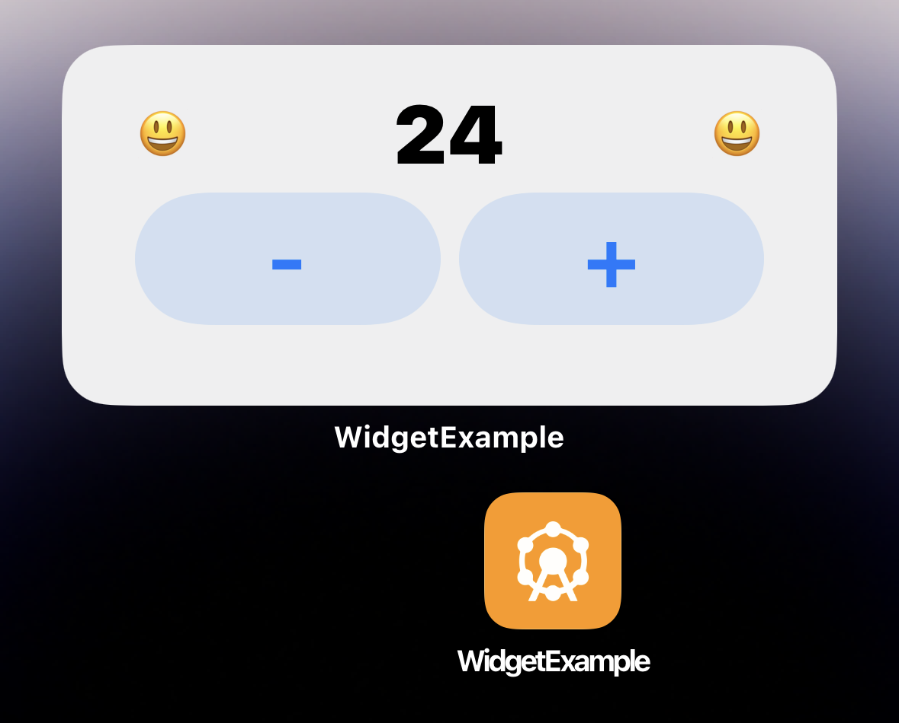
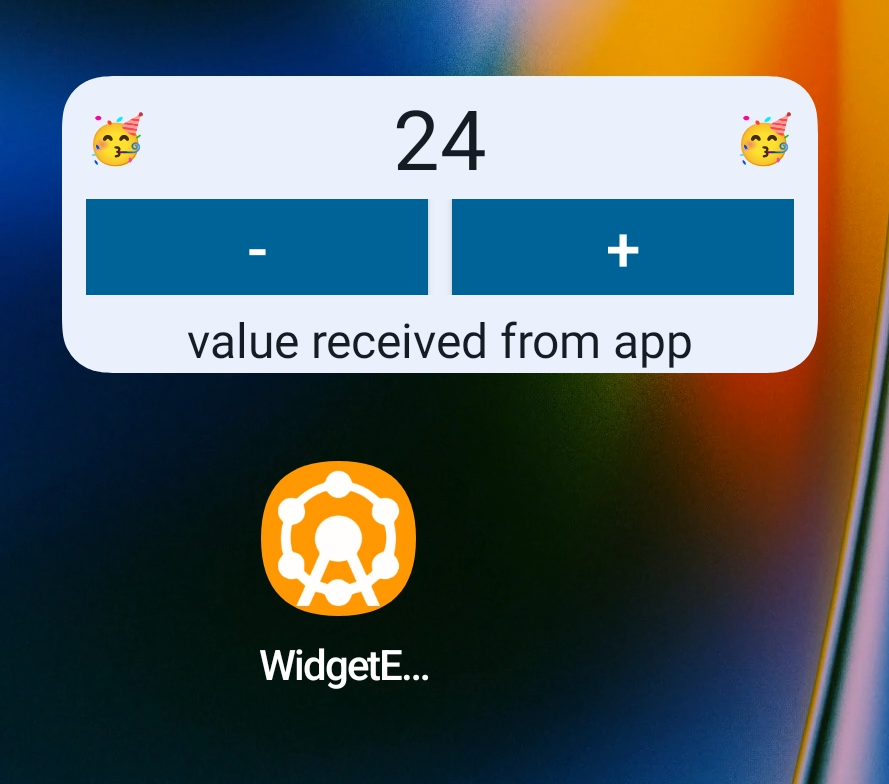

# Maui.WidgetExample
Interactive Widget example for iOS and Android with .NET MAUI

Corresponding articles:
* [iOS Widgets with .NET MAUI](./articles/article-ios-widgets.md)
* Android Widgets with .NET MAUI (comming soon)

-----------
WidgetExample Widgets:

{: style="max-height:200px"}
{: style="max-height:200px"}
