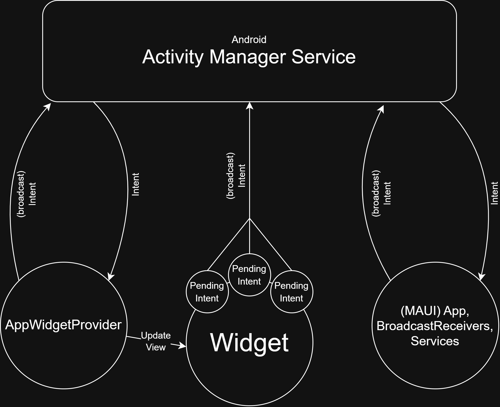

_This is a guest blog from [Toine de Boer](https://www.linkedin.com/in/toinedeboer/)._ 

This blog takes a look at the Android side of the interactive widget created in the previous blog on [iOS Widgets](https://devblogs.microsoft.com/dotnet/how-to-build-ios-widgets-with-dotnet-maui/). Compared to iOS, Android is generally less strict and easier to work with, and you can build everything directly within your MAUI project in Visual Studio. The complexity with Android, as with most things on Android, comes from the many available options to get a task done and having to consider older Android versions.

Just as in the iOS widget blog, this isn't a step-by-step tutorial. Instead, it highlights the biggest and most important parts ordered by how you'll typically encounter the main obstacles when building an Android widget. Beginning with creating a simple static widget and gradually building toward a configurable, fully interactive widget.

Source of a fully working widget on
[github > Maui.WidgetExample](https://github.com/Toine-db/Maui.WidgetExample)

## Prerequisites

For Android widgets there are no real prerequisites. Unfortunately, there are no MAUI components for Android widgets, so we have to build them ourselves using the native Android approach. The upside is that everything can be done inside Visual Studio; optionally you can use Android Studio for designing layouts with its visual editor and preview tools. Having worked extensively with Android XML layouts in the past, and because this blog focuses on functionality rather than appearance, I'm manually creating the XML layouts while using Copilot for assistance.

As soon as I want something that looks a bit more polished, I switch to Android Studio to create the layouts in XML. To do this, simply create a dummy Android project, add a widget (for example, via File > New > Widget), and start designing the XML layout. This allows you to take full advantage of the live preview tool and the attributes panel, where you can see and edit all available options for each view.

MAUI handles Android specific resource files well when you organize them in a folder structure similar to a native Android app, in the `./Platforms/Resources` folder. Thanks to this, creating a widget does NOT require any changes in your `.csproj` – the project file will remain untouched throughout this Android widget exploration. I always create or copy files and folders outside Visual Studio to prevent Visual Studio from modifying the `.csproj`. For the iOS widgets, I already created a MAUI project demonstrating a way to communicate with a widget, and I'll be reusing that for Android. Most of the existing code remains the same, all added Android widget code will go into the `./Platforms/Android` folder.

## Creating the Widget

Android widgets are not normal views like in your app but they do live inside the MAUI app. Widgets are limited to the set of Android views available through RemoteViews; custom views are not supported. Nevertheless, you can still style them reasonably well; you will likely need to be creative with shapes, vectors and other drawables. If you lack experience here, Copilot can help you with that.

The starting point of an Android widget is an `AppWidgetProvider`. It can use an `AppWidgetManager` to supply `RemoteViews` to widgets based on ID. RemoteViews are used by Android to display views from another process; they use the same XML layout style as normal Android views do, but they are loaded into a `RemoteViews` object.

```csharp
[BroadcastReceiver(Label = "My Widget")]
[MetaData(AppWidgetManager.MetaDataAppwidgetProvider, Resource = "@xml/mywidget_provider_info")]
public class MyWidgetProvider : AppWidgetProvider
{
   public override void OnUpdate(Context? context, AppWidgetManager? appWidgetManager, int[]? appWidgetIds)
   {
      if (context == null || appWidgetIds == null	|| appWidgetManager == null)
      {
         return;
      }

      // Update all widgets for specified IDs
      foreach (var appWidgetId in appWidgetIds)
      {
         var views = new RemoteViews(context.PackageName, Resource.Layout.mywidget_simple);
         views.SetTextViewText(Resource.Id.widgetText, "Count:5 (static)");
         appWidgetManager.UpdateAppWidget(appWidgetId, views);
      }
   }
}
```

The `AppWidgetProvider` relies on a required configuration file located in the `Resources/xml` folder, referenced via the `MetaData` attribute in the `Resource` field. This file lets you configure most of the widget’s settings, such as preview images, dimensions, resize limits, and features.


```xml
<!-- Resources/xml/mywidget_provider_info.xml -->

<?xml version="1.0" encoding="utf-8" ?>
<appwidget-provider xmlns:android="http://schemas.android.com/apk/res/android"
 android:minWidth="120dp"
 android:minHeight="80dp"
 android:maxResizeWidth="140dp"
 android:updatePeriodMillis="0"
 android:initialLayout="@layout/mywidget"
 android:resizeMode="horizontal|vertical"
 android:widgetCategory="home_screen"
 android:configure="widgetexample.WidgetConfigurationActivity" 
 android:widgetFeatures="reconfigurable"
 android:previewImage="@drawable/mywidget_preview_image" />
```

One of the most important entries in the configuration is `android:initialLayout` which refers to the view layout, located in the `Resources/layout`, that must be used for this widget and can be loaded as RemoteView.

```xml
<!-- Resources/layout/mywidget.xml -->

<?xml version="1.0" encoding="utf-8"?>
<LinearLayout xmlns:android="http://schemas.android.com/apk/res/android"
   android:orientation="horizontal"
   android:layout_width="match_parent"
   android:layout_height="wrap_content">

   <TextView
      android:id="@+id/widgetText"
      android:text="Static widget"
      android:textSize="16sp"
      android:layout_width="wrap_content"
      android:layout_height="wrap_content" />
</LinearLayout>
```

A big difference between a RemoteView and regular Android view is that you can't directly manipulate the view from your code. Each view only allows a limited set of properties to be updated, and all changes must go through the RemoteViews object using its special helper methods. You pass in the resource ID of the view you want to update, for example: `views.SetTextViewText(Resource.Id.widgetText, "Hello World");`

At this point, you can build the app and should see the widget appear in your phone’s widget gallery.

## Data sharing between App and Widget

Sharing data between App and widget is much simpler compared to iOS widgets because inside the widget you can use C# MAUI code. You can even share in-memory data between widget and app to some extent, although I found this approach unreliable due to lifecycle related issues between the app and the widget. It is therefore recommended to use some kind of persistent storage. It's not necessary to use Android native `SharedPreferences` and you do not need a shared GroupId (`sharedName` in MAUI) like on iOS. However, because we already set up shared data storage for the iOS widgets in this blog, we continue using the existing SharedPreferences mechanism on Android for cross-platform consistency.

```csharp
// example how to store data in .NET MAUI (Preferences)
Preferences.Set("MyDataKey", "my data to share", "group.com.enbyin.WidgetExample");

// example how to store data on Android, on the same location (SharedPreferences)
// NOT REQUIRED, because you can use the MAUI Preferences.Set()
var preferences = context.getSharedPreferences("group.com.enbyin.WidgetExample", Context.MODE_PRIVATE);
var value = preferences.getString("MyDataKey", null);
```

Additionally, SharedPreferences is a lightweight and fast storage system, so it's definitely not a bad choice for widget data storage and for keeping the widget responsive.

---
**NOTE** 

Storage keys are case-sensitive; I advise to keep keys simple and optionally consistently lowercase to avoid problems.

---

## Communication from App to Widget

Like on iOS, the Android widget doesn't know when the app updates data, and the app doesn't automatically know when the widget does. On Android, there are several ways to communicate between the app and the widget; you can even update widget views at runtime from your app. However, there's one mechanism that works reliably across all contexts and runtimes and is almost always used: using `Intents`.

The principle is simple: you create an Intent and give it an action (just a readable string). This Intent can then be broadcast whenever needed, for example, after a background process finishes or when a user presses a button on a widget.

```csharp
// Broadcast an Intent with action ‘ActionAppwidgetUpdate’
var intent = new Android.Content.Intent(AppWidgetManager.ActionAppwidgetUpdate);
Android.App.Application.Context.SendBroadcast(intent);
```

Android has dedicated components that can receive intents: activities, broadcast receivers, and services. When a component wants to receive Intents with a specific action, it must declare that action using the same action string. In MAUI, subscribing to such Intent actions is straightforward using the `[IntentFilter]` attribute. If a component needs to receive Intents from outside its own app, it must explicitly indicate this with `Exported = true`. For widgets, we need to do this because they effectively live outside the app.

```csharp
// Subscribing your AppWidgetProvider to listen to Intents
[BroadcastReceiver(Label = "My Widget", Exported = true)] // 'Exported' to make available receive Intents from other apps
[IntentFilter(new[] { AppWidgetManager.ActionAppwidgetUpdate })] // subscribe for action ‘ActionAppwidgetUpdate’
[MetaData(AppWidgetManager.MetaDataAppwidgetProvider, Resource = "@xml/mywidget_provider_info")]
public class MyWidgetProvider : AppWidgetProvider
{
   public override void OnReceive(Context? context, Intent? intent)
   {
      var myIntent = Intent;
      // …
   }
}
```

```csharp
// Subscribing a Service to listen to Intents
[Service(Exported = true)] // 'Exported' to make available receive Intents from other apps
[IntentFilter(new[] { AppWidgetManager.ActionAppwidgetUpdate })] // subscribe for action ‘ActionAppwidgetUpdate’
public class WidgetListenerService : Service
{
   public override StartCommandResult OnStartCommand(Intent intent, StartCommandFlags flags, int startId)
   {
      var myIntent = intent

      // ...
   }
}
```

```csharp
// Subscribing a Activity to listen to Intents
[IntentFilter(new[] { Intent.ActionView })] // subscribe for action ‘ActionView’, for opening via Deep Link / URL
public class MyActivity : Activity
{ 
   protected override void OnCreate(Bundle savedInstanceState)
   {
      base.OnCreate(savedInstanceState);
      var myIntent = Intent;
      // ...
   }
}
```

Each type of component exposes Intents in a different way, and their purposes with Intents differ:
* Activity: starts the app and uses the Intent
* BroadcastReceiver: instant, lives short, is destroyed after `OnReceive`
* Service: can execute background tasks and run long term
  * Note: Android may stop services, for example due to low memory. To prevent this, you can make a service a ForegroundService, which shows a notification to the user while running. Setting up a ForegroundService is outside the scope of this blog.


### Refreshing Widgets Manually

As indicated almost all communication goes by Intents. The `AppWidgetProvider` of a widget listens by default to Intents with the built‑in Android action `AppWidgetManager.ActionAppwidgetUpdate`. When such an Intent is received, the AppWidgetProvider typically triggers a refresh of the widget.

There are several ways to limit when BroadcastReceivers respond to Intents, to avoid unnecessary work or prevent Intents from being delivered to every BroadcastReceiver on the device. When broadcasting an Intent you therefore often specify a package; this ensures only components of that package (your app) can receive the Intent. Additionally, widget‑specific Intents often include widget IDs for the widgets the Intent relates to. Android itself does not act on these IDs, but when an AppWidgetProvider receives the intent, it can use them to determine which widgets should be updated.

```csharp
// Refreshing all Widgets of a specific AppWidgetProvider
public static void RefreshWidget(Context context)
{
   // Use AppWidgetManager to get all widget IDs for this provider
   var appWidgetManager = AppWidgetManager.GetInstance(context);
   var componentName = new ComponentName(context, Java.Lang.Class.FromType(typeof(MyWidgetProvider)));
   var appWidgetIds = appWidgetManager?.GetAppWidgetIds(componentName);

   // Create an intent to update the widget
   var intent = new Intent(AppWidgetManager.ActionAppwidgetUpdate);
   intent.SetPackage(context.PackageName); // only widgets from this app
   intent.PutExtra(AppWidgetManager.ExtraAppwidgetIds, appWidgetIds); // only widgets with these IDs

   // Send the broadcast to update the widget
   context.SendBroadcast(intent);
}
```

```csharp
// MyWidgetProvider.cs

// Handling incoming Intent on a AppWidgetProvider
[BroadcastReceiver(Label = "My Widget", Exported = true)]
[IntentFilter(new[]{AppWidgetManager.ActionAppwidgetUpdate})]
[MetaData(AppWidgetManager.MetaDataAppwidgetProvider, Resource = "@xml/mywidget_provider_info")]
public class MyWidgetProvider : AppWidgetProvider
{
   public override void OnUpdate(Context? context, AppWidgetManager? appWidgetManager, int[]? appWidgetIds)
   {
      if (context == null || appWidgetManager == null || appWidgetIds == null)
      {
         return;
      }

      // only update when widgets specific ID is mentioned
      foreach (var appWidgetId in appWidgetIds)
      {
         // Create the Widget view and update it with the AppWidgetManager
         var views = BuildRemoteViews(context, appWidgetId);
         appWidgetManager.UpdateAppWidget(appWidgetId, views);
      }
   }
 
   public override void OnReceive(Context? context, Intent? intent)
   {
      base.OnReceive(context, intent);
   }
```

Keep in mind that an AppWidgetProvider is a BroadcastReceiver, which means Intents are delivered on `OnReceive`. When you receive `ActionAppwidgetUpdate` and you do not invoke `base.OnReceive()`, `OnUpdate()` will never run. So `OnReceive` is the place to do optional processing based on `Intent.Action` and to decide whether or not the widget's views should be updated.

### Refreshing Widgets by Schedule

On iOS, widget updates are mostly driven by timelines managed in the TimelineProvider, and iOS limits updates to only a few dozen per day. As usual, Android provides several ways to schedule widget updates, and these approaches can be combined as needed. A full overview of all ways to schedule updates is outside the scope of this blog, here is a short summary of the most commonly used approaches and their characteristics:
1. `updatePeriodMillis` setting: Defined in the `appwidget-provider` XML configuration file. This is the easiest option, but uses a fixed update interval, which must be at least 30 minutes.
2. `AlarmManager`: Easy to use from code and capable of repeatedly broadcasting an Intent. A minimum interval of 60 seconds is advised, though this is already quite aggressive and may be restricted by Android. After a device restart, alarms are not automatically restored; you can restart them using your own BroadcastReceiver that responds to `Intent.ActionBootCompleted`, wich fired when a device starts.
3. `WorkManager`: A more complex and flexible solution for scheduling background work. It's reliable, survives device restarts, and supports many configuration options. The minimum repeat interval is 15 minutes.

## Making Widgets Interactive

Besides displaying information, a widget can also allow users to perform small actions, for example by pressing a button. These actions are also triggered via Intents, which you receive in your code and handle accordingly. However, they must be wrapped in a PendingIntent so they can be executed long after the widget and its views have been created.

PendingIntents are managed by Android. Inside your app they are reusable and when you do not make them unique they will be overwritten. PendingIntents can be made unique based on a combination of several factors, like the used actions, data and most importantly the `requestCode`. As long as you keep the requestCode unique, you should be safe.

```csharp
// MyWidgetProvider.cs

// Attach Intent to the increment button
var incrementIntent = new Intent(context, typeof(MyWidgetProvider));
incrementIntent.SetAction("com.enbyin.WidgetExample.INCREMENT_COUNTER");
var incrementPendingIntent = PendingIntent.GetBroadcast(
   context,
   101, // some request code to make PendingIntent unique
   incrementIntent,
   PendingIntentFlags.UpdateCurrent | (Build.VERSION.SdkInt >= BuildVersionCodes.S ? PendingIntentFlags.Mutable :0)
);

views.SetOnClickPendingIntent(Resource.Id.widgetIncrementButton, incrementPendingIntent);
```

PendingIntents are attached when creating the widget's RemoteView and its views. A widget itself remains a static object and has no callbacks, so you must explicitly listen for the Intent associated with, for example, a button press. This can be handled by any component that can receive Intents. A common approach is to let the same AppWidgetProvider that created the PendingIntent also receive and process the PendingIntent, to provide immediate visual feedback to the user. 

This means that, in addition to the standard ActionAppwidgetUpdate, you can define multiple custom Intent actions in your AppWidgetProvider, handle them accordingly like updating the widget's views and performing other business-logic tasks.

```csharp
[BroadcastReceiver(Label = "My Widget", Exported = true)]
[IntentFilter(new[]
{
   // listens to these specific intents
   AppWidgetManager.ActionAppwidgetUpdate,
   "com.enbyin.WidgetExample.INCREMENT_COUNTER"
})]
[MetaData(AppWidgetManager.MetaDataAppwidgetProvider, Resource = "@xml/mywidget_provider_info")]
public class MyWidgetProvider : AppWidgetProvider
{
   public override void OnReceive(Context? context, Intent? intent)
   {
      if (intent == null || context == null)
      {
         base.OnReceive(context, intent);
         return;
      }
 
      switch (intent.Action)
      {
         case "com.enbyin.WidgetExample.INCREMENT_COUNTER":
         {
            var currentCount = Preferences.Get(MainPage.SharedStorageAppIncommingDataKey,0);
            currentCount++;
            Preferences.Set(MainPage.SharedStorageAppIncommingDataKey, currentCount);
					
            UpdateAllWidgets(context);
 
            return;
         }
      }
 
      // this will trigger a OnUpdate() in this AppWidgetProvider during 'AppWidgetManager.ActionAppwidgetUpdate'
      base.OnReceive(context, intent);
   }
```

## Communication from Widget to App

Intents, Intents, and more Intents. Even something as simple as a button click ends up using Intents. These Intents can be received at various components within your app, and optionally by other apps, where they can trigger the appropriate actions.

All triggers, data transmissions, and other forms of communication to and from the widget are handled via Intents. Components such as BroadcastReceivers, Services, AppWidgetProviders and Activities can specify which types of Intents they want to listen to, and these same components can also broadcast any kind of Intent for others to receive. Below is a brief overview of the data flows, illustrating how these components communicate via Intents to manage the interactive widget.



You can also use an Intent to launch your app. In addition to broadcasting Intents in the background, you can send them directly to an Activity by using `PendingIntent.GetActivity()` instead of `PendingIntent.GetBroadcast()` when creating the PendingIntent. Like any other Intent, you can optionally attach data to it. A common approach when launching the app with an Intent is to use deep links (URLs) to pass structured data into the app. You can then retrieve the incoming data in `OnCreate()` (for a cold start) or `OnNewIntent()` (when the activity is already running).


```csharp
// MyWidgetProvider.cs

// Example of making a PendingIntent using Deep Link / URL
var openAppIntent = new Intent(Intent.ActionView);
openAppIntent.SetData(global::Android.Net.Uri.Parse("${App.UrlScheme}://${App.UrlHost}?counter=${currentCount}"));
openAppIntent.SetFlags(ActivityFlags.NewTask | ActivityFlags.ClearTop);
var openAppPendingIntent = PendingIntent.GetActivity(
   context,
   103,
   openAppIntent,
   PendingIntentFlags.UpdateCurrent | (Build.VERSION.SdkInt >= BuildVersionCodes.S ? PendingIntentFlags.Immutable : 0)
);

views.SetOnClickPendingIntent(Resource.Id.widgetText, openAppPendingIntent);

```

```csharp
[Activity]
[IntentFilter(new[] { Intent.ActionView },
   Categories = new[] { Intent.CategoryDefault, Intent.CategoryBrowsable },
   DataScheme = App.UrlScheme,
   DataHost = App.UrlHost)]
public class MainActivity : MauiAppCompatActivity
{
   protected override void OnCreate(Bundle? savedInstanceState)
   {
      base.OnCreate(savedInstanceState);
      HandleIntent(Intent);
   }
 
   protected override void OnNewIntent(Intent? intent)
   {
      base.OnNewIntent(intent);
      HandleIntent(intent);
   }
 
   private static void HandleIntent(Intent? intent)
   {
      if (intent?.Data != null)
      {
         var url = intent.Data.ToString();
         // ...handle the URL as you want
      }
   }
}
```

Compared to iOS widgets, Android widgets can directly access C# components. The `IServiceProvider` is also available, since MauiProgram.CreateMauiApp() is invoked just as it is in your app. However, it’s best to treat the widget as if it lives outside the app; therefore, business logic should not be integrated directly into AppWidgetProvider. If you want an Intent to first go through the AppWidgetProvider for widget UI updates, you can fire a new (different) Intent from there and broadcast it to the app; the app can then perform some business logic.

```csharp
// MyWidgetProvider.cs

public override void OnReceive(Context? context, Intent? intent)
{
   if (intent == null || context == null)
   {
      base.OnReceive(context, intent);
      return;
   }
 
   switch (intent.Action)
   {
      case "com.enbyin.WidgetExample.INCREMENT_COUNTER":
      {
         var currentCount = Preferences.Get(MainPage.SharedStorageAppIncommingDataKey,0);
         currentCount++;
 
         // Send silent trigger to app, that will in background do the logic and refresh this widget remotely
         var silentIntent = new Intent(context, typeof(WidgetSilentReceiver));
         silentIntent.SetAction(WidgetToAppSilentIntentAction);
         silentIntent.PutExtra(WidgetToAppSilentExtraValueField, currentCount);
         silentIntent.SetPackage(context.PackageName);
 
         context.SendBroadcast(silentIntent);
					
         UpdateAllWidgets(context);
 
         return;
      }
   }
 
   // this will trigger a OnUpdate() in this AppWidgetProvider during 'AppWidgetManager.ActionAppwidgetUpdate'
   base.OnReceive(context, intent);
}
```

When you need to execute short actions in response to an Intent, a standard BroadcastReceiver is an excellent choice. Broadcast receivers are allowed to run for only a short time (roughly 10 seconds) before Android stops them. If you need more time, use a background service `Android.App.Service` instead.

```csharp
[BroadcastReceiver(Exported = true)]
[IntentFilter([ MyWidgetProvider.WidgetToAppSilentIntentAction ])]
public class WidgetSilentReceiver : BroadcastReceiver
{
   public override void OnReceive(Context? context, Intent? intent)
   {
      if (context == null	
         || intent == null
         || intent.Action != MyWidgetProvider.WidgetToAppSilentIntentAction)
      {
         return;
      }
 
      // Extract the counter value from the intent
      var counterValue = intent.GetIntExtra(MyWidgetProvider.WidgetToAppSilentExtraValueField, int.MinValue);
      if (counterValue != int.MinValue)
      {
         Preferences.Set(MainPage.SharedStorageAppIncommingDataKey, counterValue);
      }

      // DO some other business logic if needed...
 
      // Refresh the widgets to reflect any changes
      MainPage.RefreshWidget(); 
   }
}
```

## Creating a configurable Widget

In the widget configuration file there is an option to specify an Activity as the user configuration screen for the widget. Such a widget configuration activity should be a small activity that stores its configuration changes immediately. After closing this screen the widget will automatically update its widget once.

```xml
<!— Resources/xml/mywidget_provider_info.xml -->

<?xml version="1.0" encoding="utf-8" ?>
<appwidget-provider xmlns:android="http://schemas.android.com/apk/res/android"
   android:widgetFeatures="reconfigurable" <!— makes a configuration button visible during edit mode -->
   android:configure="widgetexample.WidgetConfigurationActivity" <!— reference to Configuration Activity -->
   …
```

The field `android:configure` must reference to the Activity with the `Name` specified in the Activity itself. So pay attention to the NAME value.

```csharp
[Activity(Label = "Configure Widget",
   Exported = true,
   Name = "widgetexample.WidgetConfigurationActivity", // the same name used in the appwidget-provider
   Theme = "@android:style/Theme.Material.Light.Dialog",
   ConfigurationChanges = ConfigChanges.UiMode)]
[IntentFilter([AppWidgetManager.ActionAppwidgetConfigure])]
public class WidgetConfigurationActivity : Activity
{
   protected override void OnCreate(Bundle? savedInstanceState)
   {
      base.OnCreate(savedInstanceState);
 
      // Set result to CANCELED in case the user backs out
      SetResult(Result.Canceled);
 
      // Get the widget ID from the intent
      var extras = Intent?.Extras;
      if (extras != null)
      {
         _appWidgetId = extras.GetInt(AppWidgetManager.ExtraAppwidgetId, AppWidgetManager.InvalidAppwidgetId);
      }

   // Build the configuration View
   // The views used are NOT special widget views, so you can use eventhandlers to do actions like storing configuration changes
   SetContentView(layout);
}
```

The configuration activity is a standard Android Activity, which means it uses regular Android views rather than RemoteViews. You could probably build these screens using the full MAUI framework, but for this blog I've used basic XML layouts and a standard non-MAUI Activity.

## Using the Context

A very important concern is using the correct Android Context. It's tempting to always use the easy accessible Android.App.Application.Context in your MAUI code, but when working with widgets, this context can be null in many situations. This becomes even more important when widgets trigger background services, as using the wrong context can cause the service to crash silently. The best approach is to use the context provided by Android to the background service, if that's not available, at the very least check whether Platform.CurrentActivity is accessible to be used as the context.

## Performance Considerations

Each Android app can have only one kind of Application instance. Widgets (AppWidgetProviders) and BroadcastReceivers automatically run within this same application as the app does. As a result, using them will load the entire MAUI stack, including a call to MauiProgram.CreateMauiApp(). This can cause an initial delay of a few seconds, for example when a widget button is pressed for the first time. 

I have managed to reduce this delay to under a second after the initial load, and subsequent interactions are much faster. The key is to avoid performing any UI-related work. Fortunately, App.CreateWindow() is only invoked when an activity is created, so it is not called when loading a widget. However, most MAUI apps perform many tasks in MauiProgram.CreateMauiApp() that are unnecessary for a widget, such as loading fonts or initializing services that trigger other actions. To address this, you can create a minimal version of the MauiApp that initializes only the essentials needed for the widget to function. This minimal app can be implemented in a separate method such as CreateMinimalMauiApp().

```csharp
public static class MauiProgram
{
   public static MauiApp CreateMauiApp()
   {
      var builder = MauiApp.CreateBuilder();
      builder
         .UseMauiApp<App>()
         .ConfigureFonts(fonts =>
         {
            fonts.AddFont("OpenSans-Regular.ttf", "OpenSansRegular");
            fonts.AddFont("OpenSans-Semibold.ttf", "OpenSansSemibold");
         });

#if DEBUG
      builder.Logging.AddDebug();
#endif

      return builder.Build();
   }

   public static MauiApp CreateMinimalMauiApp()
   {
      var builder = MauiApp.CreateBuilder();
      builder.UseMauiApp<App>();

      return builder.Build();
   }
}
```

To take advantage of this minimal MAUI initialization, you need a way to detect whether the app is being started for a widget or for the full app. On Android, in the MauiApplication this can be achieved by checking the ProcessInfo of the current running app process. With this information, you can determine whether the app is running in the background, for example: handling widget updates, silent receivers, services or in the foreground as the normal app with a UI.

```csharp
[Application]
public class MainApplication : MauiApplication
{
   public MainApplication(IntPtr handle, JniHandleOwnership ownership)
      : base(handle, ownership)
   {
   }

   protected override MauiApp CreateMauiApp()
   {
      bool isBackgroundOnly = IsBackgroundExecution();

      return isBackgroundOnly
         ? MauiProgram.CreateMinimalMauiApp()
         : MauiProgram.CreateMauiApp();
   }

   /// <summary>
   /// Detects if app is running in background (widget updates, silent receivers, services)
   /// </summary>
   /// <returns>true if background execution, otherwise false.</returns>
   private bool IsBackgroundExecution()
   {
      try
      {
         var activityManager = (ActivityManager?)GetSystemService(ActivityService);
         if (activityManager == null)
         {
            return false; // Assume foreground if service not available
         }

         var runningAppProcesses = activityManager.RunningAppProcesses;
         if (runningAppProcesses == null)
         {
            return false; // Assume foreground if service not available
         }

         foreach (var processInfo in runningAppProcesses)
         {
            if (processInfo.Pid == Process.MyPid())
            {
               // Check process importance
               // Foreground (100) = Activity in foreground → full MAUI
               // ForegroundService (125) = Widget/service only → minimal MAUI
               // Visible (200) = Activity visible but not focused → full MAUI
               // Service (300+) = Background service → minimal MAUI
               // safe usage: Anything above Visible is considered background-only
               bool isBackground = (int)processInfo.Importance > (int)Importance.Visible;

               return isBackground;
            }
         }
      }
      catch
      {
         // ignore errors and assume foreground
      }

      // On error, or process not found, assume foreground to avoid breaking UI launch
      return false;
   }
}
```


To use a minimal MAUI setup on iOS, you can follow a similar approach in the AppDelegate by checking whether the app is being launched due to a silent push notification. In that case, you can initialize the minimal MAUI app. On iOS this is less critical because widgets run entirely outside the app and the app does not need to start for widget updates.


```csharp
[Register("AppDelegate")]
public class AppDelegate : MauiUIApplicationDelegate
{
   private bool _isBackgroundLaunch = false;

   protected override MauiApp CreateMauiApp()
   {
      // If woken by silent push, use minimal initialization
      return _isBackgroundLaunch
         ? MauiProgram.CreateMinimalMauiApp()
         : MauiProgram.CreateMauiApp();
   }

   public override bool FinishedLaunching(UIApplication application, NSDictionary launchOptions)
   {
      // IMPORTANT: This has NOT been fully tested with background push notifications.....yet  

      // Detect if launched by remote notification in background
      if (launchOptions != null &&
         launchOptions.ContainsKey(UIApplication.LaunchOptionsRemoteNotificationKey))
      {
         _isBackgroundLaunch = true;
      }

      return base.FinishedLaunching(application, launchOptions);
   }
}
```

---
**NOTE** 

On Android, there is also a quicker way to run a widget in a separate process by using `Process = ":widget_process"`, in the BroadcastReceiver attribute, which completely bypasses the MAUI framework. I strongly advise against this approach, as it prevents access to the essential Preferences used for data sharing, among other things.

---


## Final Thoughts

Android widgets offer more options and provide direct access to your C# code, unlike iOS widgets. However, it's important to approach this carefully and implement a solid solution that works reliably across devices, especially if you develop cross-platform. Android phones come from many different manufacturers, and some manufacturers may have OS-level restrictions for widgets, like preventing widgets from being shown on the home screen. Some brands even provide their own widget frameworks that run alongside standard Android widgets, which may be partially open or closed for your development. This blog focuses entirely on standard Android widgets, which should work well unless the manufacturer has restricted or altered the experience for its users.

Before wrapping up, here are a few final tips:
* Test your widget on both new Android devices, and at least one device running the minimum Android version you support, to ensure compatibility.
* Always use the (Android) Context provided by the AppWidgetProvider or BroadcastReceiver. When working with Android services, use the service instance itself as the Context.
* Don't let your app user pay the price for your desire to write beautiful code. For example, when displaying collections, avoid using adapter based views like ListView, which can flicker a lot. Instead, go all-in and create full-blown layout XMLs with repeated code.
