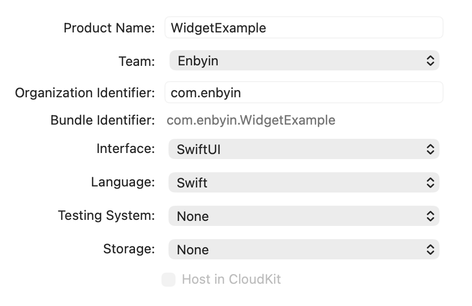
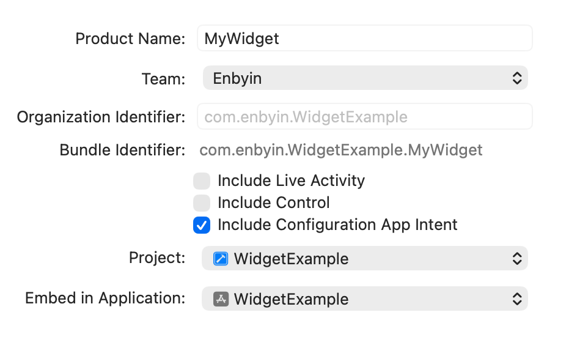
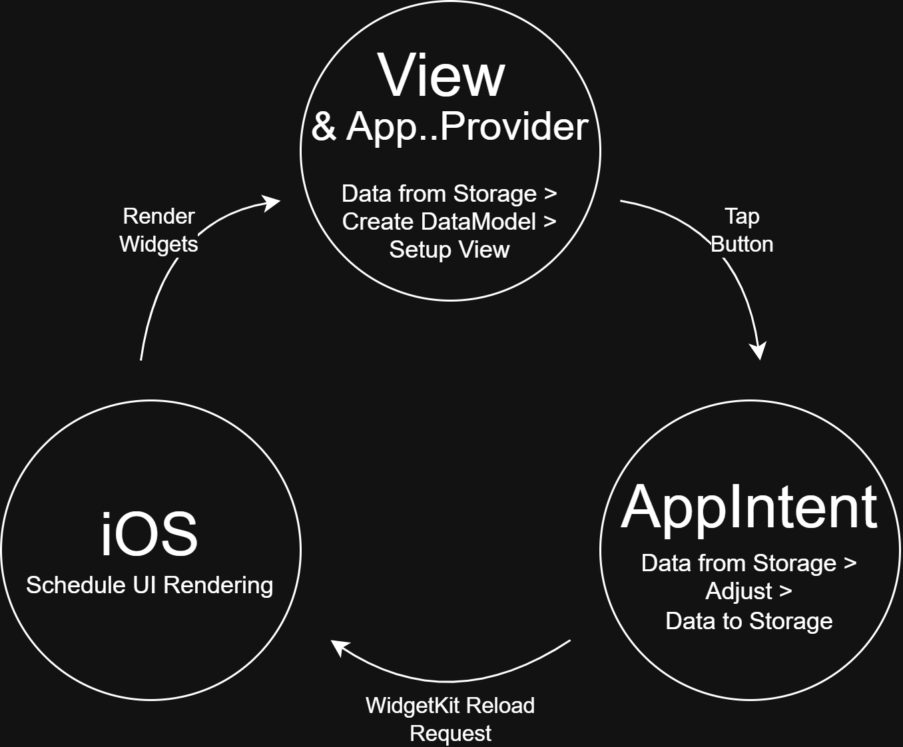



_This is a guest blog from [Toine de Boer](https://www.linkedin.com/in/toinedeboer/)_.

I'm a .NET developer primarily focused on .NET MAUI to ASP.NET backend services. Because I recently have worked a lot with Widgets and encountered many obstacles and very limited documentation in the initial phase, I decided to write this article to show that it is absolutely possible to build complete Widgets with .NET MAUI. And to do so in a professional way comparable to using the native development environment, without having to fear that everything might break with every new build or update.

I'll go through the primary challenges you'll face when creating an iOS widget, supported by a fully developed and working example source project. It's advisable to have some experience with MAUI or Xamarin, and access to macOS is required, as creating an iOS Widget without macOS unfortunately isn't possible. You can cherry‑pick what you think you need, but I recommend reading from start to finish or you may miss small details that keep the Widget from working. The text starts with creating a simple static widget, and ends with a basic system for a fully interactive widget.

Source of a fully working Widget on
[github > Maui.WidgetExample](https://github.com/Toine-db/Maui.WidgetExample)

---
**NOTE**

iOS Widgets are standalone apps that are linked to a host app. For simplicity I mostly refer to the .NET MAUI app as the 'app' and the Widget app as the 'Widget'.

---

## Prerequisites

Before we begin we need a few things from Apple's developer console. Besides the Bundle ID of your existing app you also need a Bundle ID for your Widget. If your app uses `com.enbyin.WidgetExample` then conventionally you append something for a Widget such as `com.enbyin.WidgetExample.WidgetExtension`. Additionally, both Bundle IDs need the App Groups capability with a dedicated group. Create a Group ID by prefixing the app Bundle ID with `group`, for example `group.enbyin.WidgetExample`.

What to collect from Apple Developer Console:
*  App Bundle ID (e.g. `com.enbyin.WidgetExample`)
*  Widget (App) Bundle ID (e.g. `com.enbyin.WidgetExample.WidgetExtension`)
 * Group ID (e.g. `group.enbyin.WidgetExample`)

For demo purposes I created a default MAUI app targeting only iOS and Android. I set the iOS target to the newly created Bundle ID `com.enbyin.WidgetExample`. I also added a very noticeable app icon so we can easily observe if the correct icon has been used on the Widget screens.

## Creating the Widget project

Let's begin with the biggest step for me as a .NET developer: working on Xcode and Swift. After creating the projects in Xcode, I can recommend to switch to VS Code and pair with Copilot to iterate quickly. You can have a solid small app set up quickly while following Apple's conventions.

I begin in Xcode by creating an app project using the App template using Swift coding. This serves as the base project to which I attach the actual Widget extension, and optionally, I can use it for some light testing. I give it the same Bundle ID as the MAUI app has; reusing a Bundle ID is not a problem because this almost empty Xcode app will never ship.



With the app project in place, create the Widget extension next. In Xcode go to File > New > Target and choose the `Widget Extension` template. Pick a name that already uses the correct Bundle ID for the widget so you avoid later edits. To simplify generating sample data select the `Configuration App Intent` option; this gives a working widget immediately.



When all projects are created I always align the desired iOS version, make sure it is the same for all Xcode targets. To check this just tap the solution name to open the solution settings in the main window, then set for all targets on tab 'General' under 'Minimum Deployments iOS version'. Now give it a trial run on a device using Product > Build in XCode.

### Objects and flows inside the Widget

Creating the Widget project in XCode generates many objects. Understandably it is overwhelming at first, especially because almost everything is placed into one file. Therefore I always start by refactoring: moving every object into its own file and add some folder structure. You can do this without penalty because Swift does not really use namespaces; everything inside this project effectively falls under the same namespace regardless of folder structure.

After refactoring the flow is actually straightforward. Here are the main objects, functions and their roles:

*  __WidgetBundle__: the entry point of the Widget extension, here you can expose one or more widgets to the end user
*  __Widget__: the configuration of a specific widget, here everything is listed such as the View, Provider, ConfigurationIntent and the supported sizes
*  __AppIntentTimelineProvider__: provides the data models to build the view, multiple models can be provided which are published according to a timeline. 
   *  _func placeholder_ : provides a minimal data model while the widget is loading (almost never visible)
   *  _func snapshot_ : provides a data model for when the widget is shown in the gallery as a preview and when first added to the screen
   *  _func timeline_ : provides a single data model (or a collection) for normal use, this is the main source where all data models for the widget come from
*  __TimelineEntry__: the data model instance
*  __View__: the visual elements of the widget
*  __WidgetConfigurationIntent__: enables an end-user to configure the widget, in `timeline()` of the AppIntentTimelineProvider you receive these settings so they can be processed into the data model when needed

Managing models or any other data in memory, like cache systems or just simple static fields, makes little sense. An iOS Widget is a static object that lives very briefly to perform very small action. In the AppIntentTimelineProvider the functions are invoked almost at the same time but they really run as distinct processes. For exchanging and storing data it is best to use some form of local storage (covered later).

### App Icons

Previously I had recurring problems with the widget showing wrong icons on different views. Since I explicitly added the AppIcon images to Assets in the Widget extension and referencing them in its info.plist I had almost no problems. If icons are still wrong after updating the assets and info.plist, reboot your test device because iOS seems to do some kind of icon caching with Widgets.

In Xcode the AppIcon Assets are predefined in the Widget project. When you open the AppIcon Assets page and then open the Attributes Inspector (top right) you can select iOS 'All Sizes'. This gives you the ability to set all image sizes. Personally I find that too much manual work, so I use an online iOS icon generator that produces all formats and copy them straight into the `Assets.xcassets/AppIcon.appiconset` folder.

To adjust the plist settings, open the widget extension's `Info.plist` outside of XCode (e.g. in VS Code) and insert the entries below inside the `NSExtension` section:

```xml
<key>NSExtensionPrincipalClass</key> 
<string>MyWidgetExtension.MyWidgetBundle</string>
<key>CFBundleIcons</key>
<dict>
	<key>CFBundlePrimaryIcon</key>
	<dict>
		<key>CFBundleIconFiles</key>
		<array>
			<string>AppIcon</string>
		</array>
		<key>UIPrerenderedIcon</key>
		<false/>
	</dict>
</dict>
<key>CFBundleIconName</key>
<string>AppIcon</string>
```

Adjust NSExtensionPrincipalClass using the following format:
```xml
<key>NSExtensionPrincipalClass</key>
<string>{YourWidgetModuleName}.{YourWidgetName}</string>

// YourWidgetModuleName can be found in: Extension > Build Settings > Product Module Name 

// YourWidgetName is the name of the Widget bundle, like ‘MyWidgetsBundle’ in: 
// @main
// struct MyWidgetsBundle: WidgetBundle {
```

### Creating a release build of the Widget

Release builds are easy to make in Xcode, but finding the right settings can be a hassle for me. Therefore, I use a standard script that makes it much easier to collect the releases into a dedicated folder, which can also be used in build pipelines. I run this script from the root of the Xcode projects and the releases go to an `XReleases` folder, the X to prevent them from being excluded by the default Visual Studio `.gitignore`.


```console
rm -Rf XReleases

xcodebuild -project XCodeWidgetExample.xcodeproj
 -scheme "MyWidgetExtension"
 -configuration Release
 -sdk iphoneos
 BUILD_DIR=$(PWD)/XReleases clean build

xcodebuild -project XCodeWidgetExample.xcodeproj
 -scheme "MyWidgetExtension"
 -configuration Release
 -sdk iphonesimulator
 BUILD_DIR=$(PWD)/XReleases clean build
```

### Adding the Widget release to the MAUI app

The widget build output is an `.appex` (a magic macOS bundle folder, similar to an `.app`). On Windows with Visual Studio I previously had much build errors where the appex couldn't be found. To avoid this I now place the release outputs under `Platforms/iOS/` and include them with `CopyToOutput`.

Use the snippet below in your `.csproj` to get the files available for the build:
```xml
<ItemGroup Condition="$(TargetFramework.Contains('-ios'))"> 
   <Content Remove="Platforms\iOS\WidgetExtensions\**" />
   <Content Condition="'$(ComputedPlatform)' == 'iPhone'" Include=".\Platforms\iOS\WidgetExtensions\Release-iphoneos\MyWidgetExtension.appex\**" CopyToOutputDirectory="PreserveNewest" />
   <Content Condition="'$(ComputedPlatform)' == 'iPhoneSimulator'" Include=".\Platforms\iOS\WidgetExtensions\Release-iphonesimulator\MyWidgetExtension.appex\**" CopyToOutputDirectory="PreserveNewest" />
</ItemGroup>
```

Now add the Widget extension to the MAUI app project. The ItemGroup below ensures that this is done during the build, pay attention to the paths and filenames because this is very strict.

```xml
<ItemGroup Condition="$(TargetFramework.Contains('-ios'))">
   <!-- the appex folder path without the platform suffix -->
   <AdditionalAppExtensions Include="$(MSBuildProjectDirectory)/Platforms/iOS/WidgetExtensions">
      <!-- the appex file without the .appex suffix -->
      <Name>MyWidgetExtension</Name>
      <!-- the appex folder platform suffixes -->
      <BuildOutput Condition="'$(ComputedPlatform)' == 'iPhone'">Release-iphoneos</BuildOutput>
      <BuildOutput Condition="'$(ComputedPlatform)' == 'iPhoneSimulator'">Release-iphonesimulator</BuildOutput>
   </AdditionalAppExtensions>
</ItemGroup>
```

At this point the Widget should be visible in your MAUI app build. Right now it is a Widget that works entirely on its own, without data or communications from your MAUI app.

---
**NOTE**

Widget extensions will most likely not be visible when you build from Visual Studio for 'iOS Local Devices'.

---

## Data sharing between App and Widget

iOS Widgets can best be treated as standalone apps. The MAUI app and the Widget can not freely exchange data or communicate. For data exchange we can use MAUI Preferences which maps to UserDefaults on iOS. To ensure they use the same source, both projects need an `Entitlements.plist` specifying the same Group ID which we created earlier when setting up the Bundle ID with App Groups capability.

An example `Entitlements.plist` with group id `group.com.enbyin.WidgetExample`:
```xml
<?xml version="1.0" encoding="UTF-8"?>
<!DOCTYPE plist PUBLIC "-//Apple//DTD PLIST1.0//EN" "http://www.apple.com/DTDs/PropertyList-1.0.dtd">
<plist version="1.0">
  <dict>
  <key>com.apple.security.application-groups</key>
  <array>
  <string>group.com.enbyin.WidgetExample</string>
  </array>
  </dict>
</plist>
```

For clarity: both the Widget Xcode project and the MAUI project must use such entitlements, and do not forget to create a new release of the Xcode project after adding the entitlements. Additionally the entitlements of the Widget Xcode project must also be referenced in the MAUI project under the `AdditionalAppExtensions` element in the `.csproj` for the MAUI build.

```xml
<ItemGroup Condition="$(TargetFramework.Contains('-ios'))">
   <!-- the appex folder path without the platform suffix -->
   <AdditionalAppExtensions Include="$(MSBuildProjectDirectory)/Platforms/iOS/WidgetExtensions">
      <!-- the appex file without the .appex suffix -->
      <Name>MyWidgetExtension</Name>
      <!-- the appex folder platform suffixes -->
      <BuildOutput Condition="'$(ComputedPlatform)' == 'iPhone'">Release-iphoneos</BuildOutput>
      <BuildOutput Condition="'$(ComputedPlatform)' == 'iPhoneSimulator'">Release-iphonesimulator</BuildOutput>

      <!-- entitlements for the appex, without this the shared storage won't work -->
      <!-- errors that entitlements could not be found: include the entitlements with CopyToOutput -->
      <!-- errors when reading entitlements during build: store entitlements file with line-ending type LF -->
      <CodesignEntitlements>Platforms/iOS/Entitlements.MyWidgetExtension.plist</CodesignEntitlements>
   </AdditionalAppExtensions>
</ItemGroup> 
```

At this point the App and Widget should be able to use the same data source. In both projects the usage of a specific Group ID must be indicated explicitly in code. In MAUI do NOT use `Preferences.Default`; instead provide the Group ID in the `sharedName` parameter.

```csharp
// example how to store data in .NET MAUI.
Preferences.Set("MyDataKey", "my data to share", "group.com.enbyin.WidgetExample");
```

```swift
// example how to store data in Swift.
UserDefaults(suiteName: "group.com.enbyin.WidgetExample")?.set("my data to share", forKey: "MyDataKey")
// example how to get data in Swift.
let data = UserDefaults(suiteName: "group.com.enbyin.WidgetExample")?.string(forKey: "MyDataKey")
```

---
**NOTE**

Storage keys are case-sensitive; I advise to keep keys simple and optionally consistently lowercase to avoid problems.

---

## Communication from App to Widget

The Widget does not know when the App shares data and the App does not know when the Widget does so. Signaling new available data from the App to the Widget uses a different mechanism than from Widget to App. Signaling from App to Widget is easy with Apple's WidgetKit API. This API is not available in MAUI so you must create a binding yourself. It is a very small API and great to experiment with bindings yourself. For this demo I use a NuGet package `WidgetKit.WidgetCenterProxy` where this has already been done for us.

The WidgetKit API mainly provides two options: reload all widgets on the device or reload only widgets of a specific `kind`. I always use the latter because the platform will ignore you if you use one of these options too frequently; I imagine they also prefer that you only update your own specific widgets. The `kind` of your Widget is easy to find in your Widget object in Swift; under the `kind` property.

```csharp
// Example on how to refresh all Widgets of kind ‘MyWidget’ in .NET MAUI
var widgetCenterProxy = new WidgetKit.WidgetCenterProxy();
widgetCenterProxy.ReloadTimeLinesOfKind("MyWidget");
```

---
**NOTE**

WidgetKit reload functions are  polite request to the OS; it decides when it happens and whether you are using it too often. Usually the widget refresh happens immediately.

---

## Communication from Widget to App

Communication from Widget to App can happen in two ways, optionally with a very small amount of data. By default a Widget opens the corresponding app when you tap it, if you overwrite this with `widgetUrl()` you can open the app with a Deep Link that includes data in the url. A drawback is that a Widget is build as a static object, when using `widgetUrl` the URL must be determined beforehand when setting up the Widget view (often happens in the provider) and passed as string through the data model.

```swift
// example of using a DeepLink url in Swift
Struct MyView : View {
   var body: some View {
   // my views
   }.widgetUrl(URL(string: "mywidget://something?var1=dummy-data")
}
```

A different way to communicate can originate from AppIntents. An AppIntent is a way to execute actions/logic that you can attach to interactive elements like buttons. It is also the place where the OS gives you a bit of time to perform long during actions, like for making http calls. When you combine local storage with AppIntents you can create a full 'Interactive Widgets', as shown in the rendering cycle image below.



For example you can attach a custom AppIntent to a button in your Widget that changes a value in storage, after which the AppIntent itself triggers a refresh of the Widget. The system reloads the widget by calling AppIntentTimelineProvider, creating a new data model (timeline entry) and re-rendering the view with the updated data.

```swift
// example of an AppIntent changing data and reloading widget
struct IncrementCounterIntent: AppIntent {
   static var title: LocalizedStringResource { "Increment Counter" }
   static var description: IntentDescription { "Increments the counter by 1" }
 
   func perform() async throws -> some IntentResult {
 
   var currentCount = 0
 
   let userDefaults = UserDefaults(suiteName: Settings.groupId)
   let storedValue = userDefaults?.integer(forKey: Settings.appIncommingDataKey)
   if let storedValueCount = storedValue {
      currentCount = storedValueCount
   }

   // do action
   let newCount = currentCount + 1
 
   // Save new value
   userDefaults?.set(newCount, forKey: Settings.appIncommingDataKey)
 
   // Reload timelines > refreshing widget
   WidgetCenter.shared.reloadTimelines(ofKind: "MyWidget")
 
   return .result()
}
```

```swift
// example of Button using AppIntent in Swift
struct MyWidgetView : View {
   var entry: Provider.Entry
 
   var body: some View {
      VStack(spacing:4) {
         Button(intent: IncrementCounterIntent()) {
            Text("+")
         }
      }
      .padding()
   }
}
```

### Silent communication from Widget to App

On iOS, a Widget can NOT communicate with the App in the background. Any direct call brings the App to the foreground. To keep the App closed and still perform work, you can use AppIntents in the Widget to call your backend. The backend can execute the action and, if needed, send a silent push notification to the App. The App can then handle the update in the background if required. This can be done with any web service and existing push notification provider; For that reason, I've included only an illustrative SilentNotificationService as entry point in the demo code rather than a full implementation.

## Create a configurable Widget

Because I selected the 'Configuration App Intent' option when creating the XCode Widget extension, there is already a working system in place that allows the user to configure the widget. In the loop of creating the data model in `AppIntentTimelineProvider`, this configuration becomes available and can be processed into the data that is passed to the Widget view. It's a simple basic system that's all implemented in a `WidgetConfigurationIntent` that is specified in the `WidgetConfiguration` for the specific Widget.


```swift
struct MyWidget: Widget {
   let kind: String = "MyWidget"

   var body: some WidgetConfiguration {
      AppIntentConfiguration(kind: kind, 
      intent: ConfigurationAppIntent.self,
      ...
```


Visually, there is nothing to customize in the WidgetConfigurationIntent. You only need to add '@Parameter' fields for the settings you want users to configure; the platform handles the UI automatically.

```swift
struct ConfigurationAppIntent: WidgetConfigurationIntent {
   // title: mainly for Siri/shortcuts, keep it simple if you dont use Siri
   static var title: LocalizedStringResource { "Configuration" }
   // description: mainly for developers in the app intents system, users will never see this 
   static var description: IntentDescription { "This is an example widget." } 

   // An example configurable parameter.
   @Parameter(title: "Favorite Emoji", default: "😃")
   var favoriteEmoji: String
}
```


Most built-in types can be used with @Parameter, such as String, Int, Bool, Date, etc. For more complex types like lists or custom objects, a separate type can be created that implements `AppEntity`. This is a somewhat more extensive topic that I won't cover completely here. The principle is simple: the AppEntity object is a selectable datamodel that provides its own options through an `EntityQuery`. This EntityQuery delivers a collection of AppEntity objects from which the user can choose. It's important to know that the platform can iterate through the different functions of the EntityQuery multiple times, and again these functions have difficulty exchanging data with eachother. My advise is to use local storage (UserDefaults) to cache and exchange data between the different functions.

## Streamlining widget development

With the complete interactive widget in place, the next step will be implementing your logic and refining the widget's layout and styling. Ideally all logic goes into the MAUI app so you can reuse it on other platforms too. Unfortunately you can't avoid implementing some parts in Swift, such as handling storage, building views, or some small communication with your backend. 

The transition from C# to Swift has a small learning curve in my opinion; that's why I advise to use VS Code and to pair-program with Copilot to be as C# to Swift translator. Copilot will not make everything perfect in a single run and not without errors, but it will give you a great sparring partner and will help you get a lot done quickly. Combine this with an open XCode at the same time to build and test frequently to catch issues early. Do this with the Widget opened in a XCode Canvas view using #preview data, so you can see visual changes instantly after every build.

